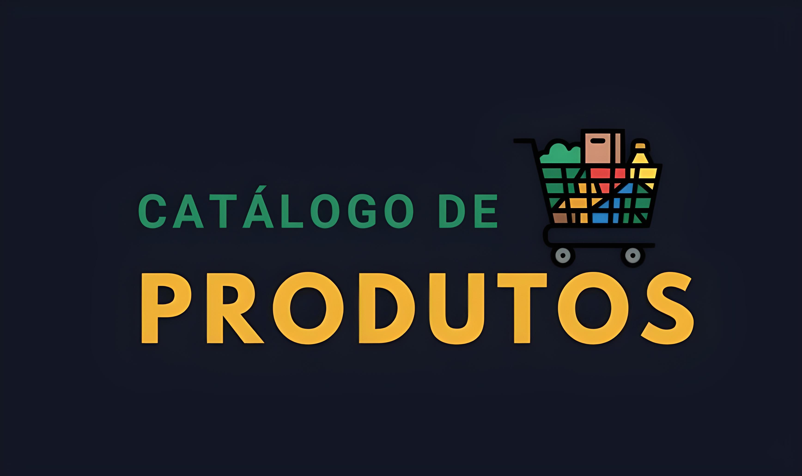

## {:width="300px"}

Catálogo de produtos com spring boot

Este é um projeto Spring Boot básico configurado para utilizar Java 17 como versão do JDK e o IntelliJ IDEA como editor de código fonte.

## Objetivo
API REST desenvolvida para consultas de produtos de supermercado, sendo, a consulta e lista de produtos no catálogo livre ao público. Cadastros, apagamento e atualização de produtos sendo restrito apenas
a funcionários cadastrados no sistema.

## Pré-requisitos

Certifique-se de ter as seguintes ferramentas instaladas antes de começar:

- [Java Development Kit (JDK) 17](https://openjdk.java.net/)
- [IntelliJ IDEA](https://www.jetbrains.com/idea/)

## Configuração do Projeto

1. **Clone o repositório:**

    ```bash
    git clone https://github.com/seu-usuario/seu-projeto.git
    ```

2. **Abra o projeto no IntelliJ IDEA.**

3. **Certifique-se de que o projeto está configurado para usar o JDK 17:**

    - Abra as configurações do projeto (`File > Project Structure`).
    - Em `Project`, certifique-se de que o `Project SDK` é configurado para o JDK 17.

4. **Executando o Projeto**

    1. Vá até a classe principal do aplicativo Spring Boot (geralmente anotada com `@SpringBootApplication`).
    2. Execute a aplicação clicando com o botão direito na classe e selecionando `Run`.
    3. O aplicativo será iniciado e estará disponível em [http://localhost:8080](http://localhost:8080).

## Contribuição

Sinta-se à vontade para contribuir para este projeto. Faça um fork do repositório, faça as alterações desejadas e envie um pull request.

